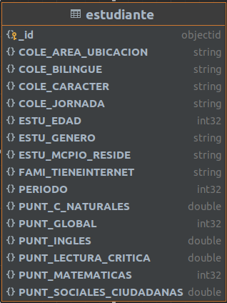

# Descripción

- Para la base de datos se utiliza docker con la imagen de mongo.
- Se utiliza docker file que contiene la imagen, ademas copia al contenedor el csv a con los datos y el archivo init.sh.
- El archivo init.sh es el encargado de ejecutar el comando para importar el csv apenas se inicialice el docker compose.
- Se crea por defecto usuario: root, pass: root.
- Se crea por base de datos: icfes_valle.

## Consideraciones

- Tener instalado docker y docker compose,
- Se debe tener el csv de los datos a importar con el nombre 'data_valle.csv'.

## Comandos

- Para correr por primera vez usar:
  docker compose up -d --force-recreate --no-deps --build mongodb

- Para correr normalmente:
  docker compose up 

- Para detener:
  docker compose down

## Modelo de base de datos

A partir del proceso etl se obtienen los datos a manejar. Se le denomina data a la collection(tabla).

