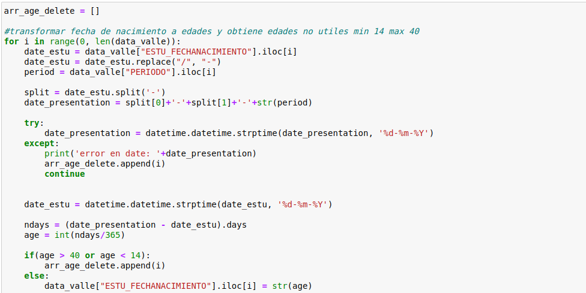
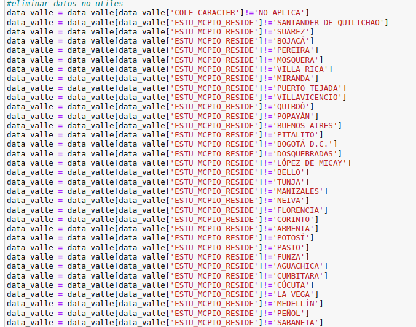

# Descripción

- Para el proceso de etl se utilizo el software de anaconda el cual permite el manejo optimo en ciencia de datos. 
- Se genera apartir de jupyter notebook un cuadernillo con el paso a paso del proceso etl.
- Pag oficial: https://www.anaconda.com/products/distribution

## Consideraciones

- Para correr el cuadernillo (etl_icfes_valle.ipynb), necesario instalar anaconda.
- Tener en una maquina con gran capacidad ya que el proceso es pesado.

## Paso a paso

- Para iniciar el paso a paso se requiere activar jupyter notebook el cual viene con el software de anaconda.
  donde se podra abrir etl_icfes_valle.ipynb:

  
  

- Los datos para el proyecto se obtienen de la pagina datos.gov donde se encuentran datos del icfes a nivel nacional(2010-2021)
  (Nota: si se ejecuta en windows se debe instalar wget: https://anaconda.org/anaconda/wget)
- Wget permite descargar el csv que contiene 6 millones de datos aproximadamente.
- Se descargan los datos con el nombre rows.csv

  
  
  
- Se importa pandas libreria de python.
- A partir de pandas leemos el csv donde se convierte a dataframe que permite mejor manejo de los datos.
- Se filtra por periodo para obtener rango de 2017-2021
- Se filtra por departamento, en este caso solo usamos los datos del valle
- Para transformar los periodos se hace necesario pasarlo a tipo string 
- Se transforma periodos 20171,20172 a 2017 de esta manera con los demas años hasta 2021
  

  
  
  
- Eliminamos columnas no utiles donde no se usaran para posteriores filtros, estas son:
  ['Unnamed: 0.1', 'Unnamed: 0','ESTU_CONSECUTIVO','COLE_CALENDARIO','COLE_COD_DANE_ESTABLECIMIENTO', 'COLE_COD_DANE_SEDE', 'COLE_COD_MCPIO_UBICACION', 'COLE_COD_DEPTO_UBICACION', 'COLE_CODIGO_ICFES', 'COLE_GENERO', 'COLE_MCPIO_UBICACION', 'COLE_NATURALEZA', 'COLE_NOMBRE_ESTABLECIMIENTO', 'COLE_NOMBRE_SEDE' , 'COLE_SEDE_PRINCIPAL', 'ESTU_COD_DEPTO_PRESENTACION', 'ESTU_COD_DEPTO_PRESENTACION', 'ESTU_COD_MCPIO_PRESENTACION', 'ESTU_COD_RESIDE_DEPTO', 'ESTU_TIPODOCUMENTO', 'ESTU_COD_RESIDE_MCPIO', 'ESTU_DEPTO_PRESENTACION', 'ESTU_DEPTO_RESIDE', 'ESTU_ESTADOINVESTIGACION', 'ESTU_ESTUDIANTE', 'ESTU_MCPIO_PRESENTACION', 'ESTU_NACIONALIDAD', 'ESTU_PAIS_RESIDE', 'ESTU_PRIVADO_LIBERTAD', 'FAMI_CUARTOSHOGAR', 'FAMI_PERSONASHOGAR', 'FAMI_TIENEAUTOMOVIL', 'FAMI_TIENELAVADORA']

- Validamos que las columnas utiles no tengan campos nulos, de ser asi se eliminan esos registros.
  

  

- Ya que algunas fecha de nacimiento incian con el año 0 se contempla como datos no utiles, por ello se obtienen las posiciones
  de estos datos para posteriormente eliminarlos del dataframe.

  
  
  

- Las fechas de nacimiento las transformamos a edades , ademas ya que algunos registros tienen fechas erroreas y edades que se contemplan como no utiles
  se guardan su posicion para posteriormente eliminarlos.

  
  
  

- Renombramos el campo ESTU_FECHANACIMENTO a ESTU_EDAD
- Se transforma los datos del campo COLE_BILINGUE. ademas se obtienen los datos nan los cuales no son utiles para posteriormente eliminarlos.

  
  

- Finalmente eliminamos columnas inncesarias y exportamos el csv final a utilizar.

  